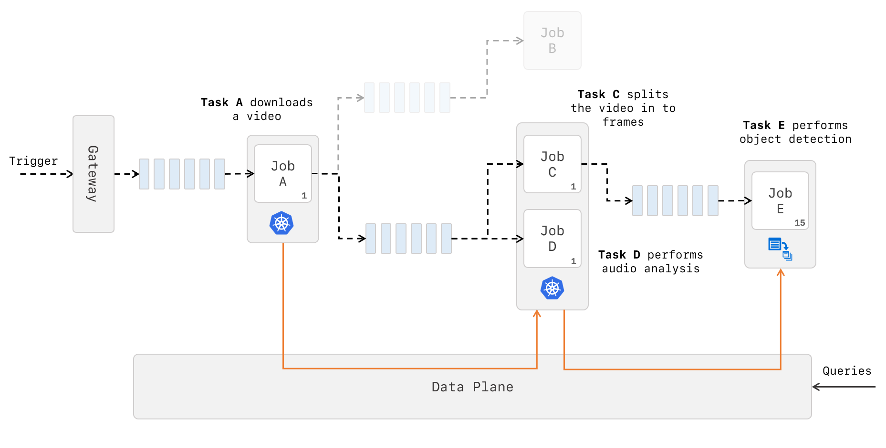
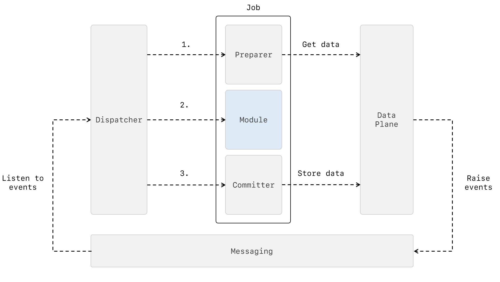

<p align="center">

</p>

[](https://travis-ci.org/lawrencegripper/ion)

> **Warning**: Ion is currently in initial development and has an unstable API. If you would like to evaluate Ion for a project, please contact the maintainers directly.

**Ion** is a scalable, event-driven, data processing platform on Kubernetes. It enables you to programmatically build, schedule and monitor workflows of independent, self-contained modules packaged as containers. Ion will orchestrate your desired workflow across various underlying environments, giving you the choice to use the right tool for each specific module whilst benefiting from a single control plane.

# Getting Started
Ion is composed of a set of components. The easiest way to get up and running is to use our Terraform deployment as instructed below.

### Prerequisites:
* [Terraform](https://www.terraform.io/)
* [Azure Subscription](https://azure.microsoft.com/)
* Azure Subscription Service Principal
* [Kubectl](https://github.com/kubernetes/kubectl)
* [Docker](https://www.docker.com/)

### Steps
1. Setup Terraform for Azure following [the guide here](https://docs.microsoft.com/en-us/azure/virtual-machines/linux/terraform-install-configure)
2. Clone the Ion repository
```shell
git clone git@github.com:lawrencegripper/ion.git
```
3. From the command line navigate to the repository's deployment folder
```shell
cd ./ion/deployment
```
4. Edit the `vars.example.tfvars` file and add in your own Azure Service Principal details and adjust the node count as appropriate.

5. Download the latest version of the Community Kubernetes Provider for Terraform. Get a suitable link [from here](https://github.com/sl1pm4t/terraform-provider-kubernetes/releases). We are using this provider as currently the official Kubernetes provider doesn't support `Deployments`. You can either run the commands below.
```shell
curl -L -o - PUT_RELASE_BINARY_LINK_YOU_FOUND_HERE | gunzip > terraform-provider-kubernetes
chmod +x ./terraform-provider-kubernetes
```
5. (cont.) Or, use the appropriate provided script for your platform (found in the `deployments` folder); `bootstrap_linux.sh`, `bootstrap_mac.sh` and `bootstrap_windows.ps1`

6. Use `terraform init` to initialize your working directory and config
7. Use `terraform plan -var-file=./vars.example.tfvars` to generate a terraform deployment plan
8. Once you have reviewed the plan, if you are happy to continue, run `terraform apply -var-file=./vars.example.tfvars` to initiate the terraform deployment (this may take in the region of 25 mins).
9. After the deployment has completed, use `az aks get-credentials` to connect `kubectl` to your new AKS cluster
10. Grab the client and ca certificates from the terraform output
```shell
terraform output ion_ca > certs/ca.pem
terraform output ion_client_cert > certs/client.crt
terraform output ion_client_key > cert/sclient.key
```
11. Grab the management API fully qualified domain name (FQDN) from the terraform output
```shell
export ION_FQDN=$(terraform output ion_fqdn)
```
12. Connect to the API using the Ion CLI docker image
```shell
docker run --rm -v "${PWD}/certs":/opt/ion/ ionuser/ion-cli module list \
--endpoint "$ION_FQDN:9000" \
--certfile /opt/ion/client.crt \
--keyfile /opt/ion/client.key \
--cacertfile /opt/ion/ca.pem
```
13. Now we have deployed all the Ion components and validated we can connect to our Ion management server via the Ion CLI, we can deploy a sample module.
```shell
docker run --rm -v "${PWD}/certs":/opt/ion/ ionuser/ion-cli module create -i frontapi.new_link -o file_downloaded \
-n downloader -m ionuser/ion-module-download-file \
-p kubernetes --handler-image ionuser/ion-handler \
--endpoint "$ION_FQDN:9000" \
--certfile /opt/ion/client.crt \
--keyfile /opt/ion/client.key \
--cacertfile /opt/ion/ca.pem
```

14. You can now re-run the command from step 12 to see the module deployed to your Ion environment. This sample module won't do anything without being hooked up to a gateway that can trigger it (such as Ion's front API). However, this guide demonstrates how you can get an Ion environment up and running and deploy modules via the CLI.

> *Next Step*: Have a look at the [Quick start for transcoding](./docs/QuickStartTranscode.md) to get a more detailed guide on chaining together ION modules. 

# Why use Ion?
Another workflow manager... really?!
There is no shortage of tools that can string together a series of processes into a structured workflow.
However, Ion has some key differentiators that make it very suitable to certain workloads.

## Heterogenous Environments
Most existing workflow tools assume a homogenous execution environment i.e. each task is alike and has the same computational needs. However this isn't always the case, 1 task may need to render video frames for 48 hours on preemptable machines with GPUs whilst another simply transforms a small document from JSON to YAML and could compute in seconds on a shared host. Ion makes these vastly different requirements easy to satisfy with a single tool by orchestrating tasks onto other execution environments for fulfillment. Ion will then monitor the task across execution environments to give you a single aggregated view.

 Currently supported enviornments:
 * Kubernetes
 * Azure Batch

## State Management
A lot of workflow tools tend to follow a purely functional pattern, where state only exists as inputs and outputs of functions. This means that if you do want to store additional state, you end up writing custom tasks to read from and write to some external storage. With Ion, we decided to make data a first-class citizen of the platform. This means making handling data for the users as simple and intuitive as possible. Ion takes care of persisting data and transitioning it between different tasks in the workflow by leveraging various storage technologies as components of its data plane. Leaving the task author to simply read and write to disk without concerning themselves with external storage.

Currently supported blob storage services:
* Azure Blob Storage

Currently supported document storage services:
* MongoDB
* Azure CosmosDB

## Eventing
It would be naive to suggest other workflow tools don't have a sufficent eventing solutions. However, these are often opaque to the user with little or no configurability. Ion simply relies on the publish/subscribe pattern for topic based eventing from existing queuing technology. Ion's components handle the interactions with the underlying event bus so that you can focus on creating business value. As a task author, you simply define what events you are interested in and which you wish to raise and Ion will handle the rest.

Currently supported event buses:
* Azure Service Bus



## Who was Ion built for?
Ion has primarily been designed to give data scientists the power to chain together image and video classification models into a hierarchial tree. This pattern was to allow media (images/video) to pass through various levels and types of classifier in a distributed fashion. This use case drove many of the decisions to abstract out the data plane and to provide [heterogenous execution environments](#heterogenous-environments). However, in principle, Ion is a generic task orchestrator and could be leveraged in any number of workloads. Nonetheless, we appreciate that certain decisions we have made may have constrained Ion for your purpose, if this is the case or you have other issues you'd like to discuss, please open a new issue on our GitHub page.

## How does Ion work?
Ion is built to harness the power of cloud platform services that allow it to be elastically scalable, fault tolerant and programmatically managed.

The Ion platform is comprised of 4 main components:

* [Dispatchers](#dispatchers)
* [Jobs](#jobs)
* [Modules](#modules)
* [Management API](#management-api)

## Dispatchers
Dispatchers can be configured to subscribe to certain event topics on an external messaging service. Multiple Dispatchers can subscribe for the same events to allow scalability. When a Dispatcher dequeues a message, it extracts requirements about the job, applies business logic rules and then dispatches a new job to be scheduled onto an appropriate execution environment. Supported executors include:

* Kubernetes
* Azure Batch
* Local

The Dispatcher uses different providers to schedule jobs onto execution environments. If you wish to add support for a new provider, please open a new GitHub issue with a proposal.

## Jobs
A job is the unit of deployment for a Dispatcher, it contains 3 components. A [Preparer](#preparer), [Module](#modules) and a [Committer](#committer). The job should be provided with all the parameters it needs to successfully fulfil its work during dispatch.

#### Modules
A module is analogous to a task. It is the program that the user wishes to execute in response to a particular event. This is likely the only component a user of the platform needs to be concerned with. The module can be written in any language but should be containerized along with all its dependencies.

#### Preparer
The preparer is the first component of a job to execute. It is responsible for initialising the environment in which the module will run. This includes downloading any data the module needs and creating the directory structure.

#### Committer
The commit is the last component of a job to execute. It is responsible for uploading any data the module may have created and raising any output events.

## Management API
Ion comes with a management API that can be used to operate modules. At current this can provide very basic management functionality such as create, delete and list modules. It also comes with an accompanying CLI tool that provides a simple way to manage Ion resources. In future we hope to extend this to provide a UI and more advanced integration with Ion's tracing system.



## Developing

Ensure you have your [Go](https://golang.org/) environment correctly setup then run `go get github.com/lawrencegripper/ion` to pull the source into your $GOPATH.

You can build the repository using [Make](https://www.gnu.org/software/make/). Simply run the `Makefile`:
```shell
make
```

To check changes using the same process as the CI build run `./ci.sh` at the root directory and check the output for any errors.

This will check the `/dispatcher` and `/handler` directories. If you add an additional folder/service add your new path and add a new line into `./ci.sh` to invoke it with the correct `FOLDER` build arg.