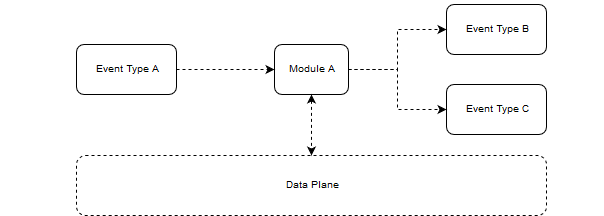

# Module
A module is a processing unit or task. It can be written in any language as long as it has all its dependencies packaged into a container. A module is executed by the Dispatcher as the result of an event trigger. A module can also trigger other modules by emitting new events. The module can choose to pass data to the subsequent modules such as files or metadata. This data will be handled by Ion's data plane. Please refer to the [sidecar docs](../sidecar/README.md) for more information.

## Writing a Module
The recommended approach to writing a module is to write your processing code without any integration with Ion. For instance, if I wanted to write a module to resize an image. I could write a simple Python script to read a file from disk,use OpenCV to resize it, then write it to disk again.

## Ionizing a Module
In order to ionize your module, you'll need to integrate with Ion on 3 levels:

* Environment variables
* Filesystem
* API - We are investigating removing this dependency in the future

### Envrionment variables
Each module will be supplied with the following environment variables:
* `SHARED_SECRET` - Used to authenticate requests to Ion's sidecar
* `SIDECAR_PORT` - The local port your module can communicate with Ion's sidecar on
* `SIDECAR_BASE_DIR` - **[Development Only]** Used to set the base directory for the module to write state to. If not provided, will default to `/ion/`.

### FileSystem
Ion expects a module to read/write data that is intended to be passed between modules or persisted using a specific directory structure. For details on how to leverage this directory structure, please refer to the [sidecar docs](../sidecar/README.md).

### API
Ion will handle the transition of data between your modules for you if you instruct it to do so. This requires you to make a few simple calls to the sidecar's API. For more information on how to do this, please refer to the [sidecar docs](../sidecar/README.md).

## Developing with the Sidecar
In order to run your module against the sidecar, you'll need to follow the instructions on the [sidecar docs](../sidecar/README.md) to get the side car up and running.

Please review the `--development` configuration on the [sidecar docs](../sidecar/README.md).

Once you have the sidecar running, you can simply execute your module locally with the correct environment variables set and it should communicate with the sidecar. If you're using `development` mode you will not need to provide the sidecar with any external provider configuration and data will be stored in a `dev` directory.

### Chaining Modules Locally

> NOTE: When offline mode is supported as documented on the [sidecar docs](../sidecar/README.md), you will be able to use the local dispatcher to orchestrate this flow.

If you wish to develop multiple modules locally and have them chained together, you will need to write an orchestration script. The script will configure and run the first module (likely setting the `baseDir` config to a relative path i.e. `module1`).

The first module will output event data into the development directory `dev`. Once the first module has complete, grab the event context for the event your second module is going to process from the `dev` directory. Parse the event context JSON to extract the field:

* `context.eventId`

Configure your second module with a fabricated event Id. The event Id you extracted from the file should be passed in as the parent event Id. Run the secondary module and it should configure itself to load the resources output by your previous module.

## Dispatching a Module
The Dispatcher can only deploy Modules as containers. Therefore, it is required for you to containerize your module and upload it to an accessible container repositories i.e. [DockerHub](https://hub.docker.com). Once your container image is uploaded, refer to the [Dispatcher docs](../dispatcher/README.md) on how to run the Dispatcher.

When the Dispatcher is running, it will dispatch your module in response to a new event on the topic it is subscribed to. We are currently writing a `gateway` service that will be able to trigger your module via a web hook. However, currently you need to publish a message to the topic manually.

